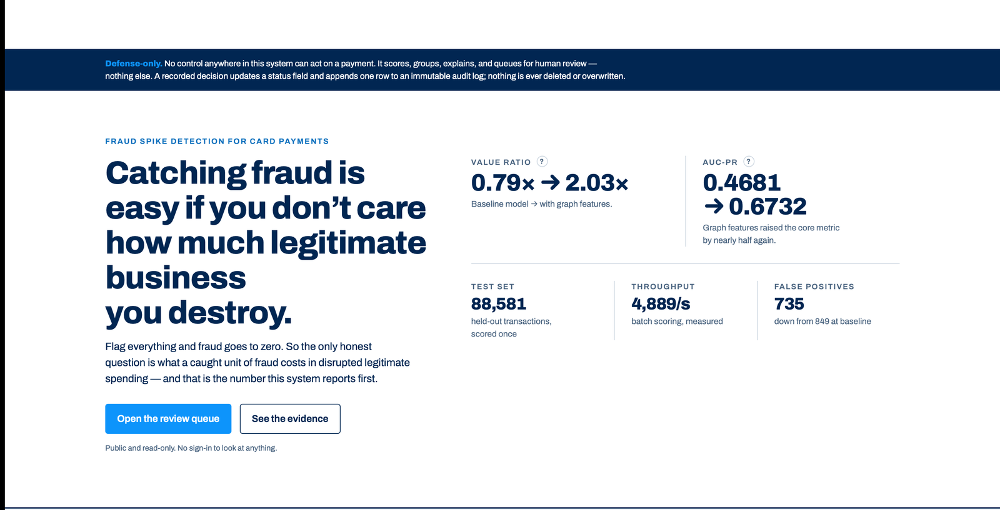
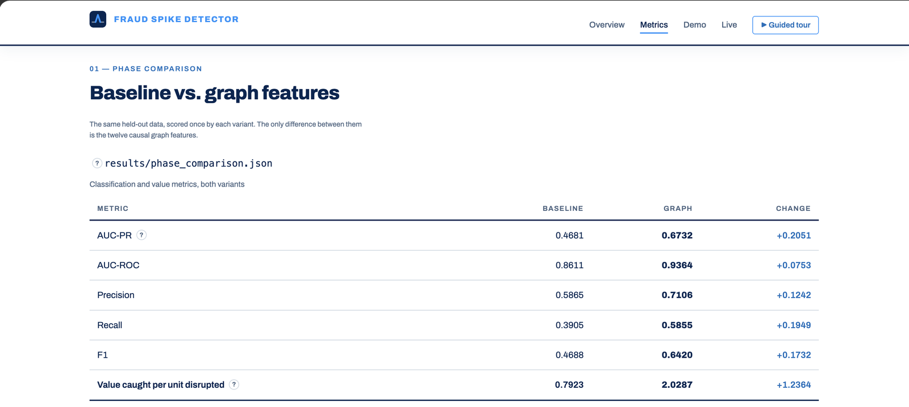
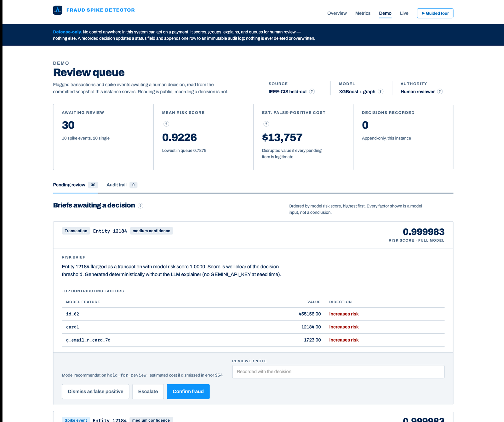
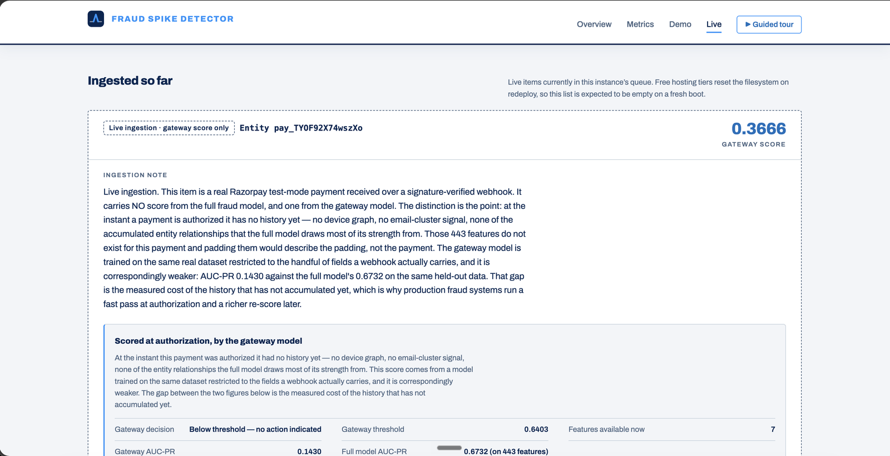
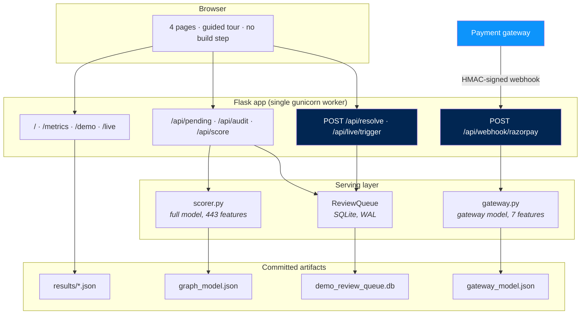
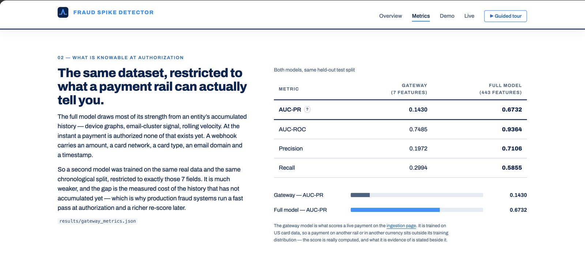

<p align="center">
  
</p>

<p align="center">
  <a href="https://fraud-spike-review-queue.onrender.com"></a>
  <a href="https://github.com/fyzahm3/fraud-spike-detector/actions/workflows/tests.yml"></a>
  <a href="LICENSE"></a>
  
</p>

<h1 align="center">Fraud Spike Detector</h1>

<p align="center">
  <b>Catching fraud is easy if you don't care how much legitimate business you destroy.</b><br>
  This system reports what a caught unit of fraud costs in disrupted legitimate spending — before it reports accuracy.
</p>

---

Per-transaction risk scoring, rolling per-entity spike detection, and a written brief for every
flagged item — delivered into an auditable queue where a **human makes every decision**. Trained on
590,540 real card transactions and evaluated once on a chronologically held-out split.

**[▶ Open the live demo](https://fraud-spike-review-queue.onrender.com)** — public, no sign-in.
Take the built-in **guided tour** for a 14-step walkthrough of the whole project.

## What it does

- [x] **Scores every transaction** with XGBoost over 443 features. [Results ↓](#measured-results)
- [x] **Learns entity behaviour** — 12 causal co-occurrence features over card / email / device / address. [How ↓](#how-it-works)
- [x] **Detects spikes, not just outliers** — rolling 1h and 24h windows against each entity's own baseline.
- [x] **Explains in plain English** — an LLM writes the prose and *only* the prose. [Why ↓](#the-llm-writes-prose-and-nothing-else)
- [x] **Queues for human review** with an append-only audit log. Nothing is ever edited or deleted.
- [x] **Scores live payments** from a real payment gateway, at authorization time. [Two-pass ↓](#live-payments-the-two-pass-design)
- [x] **Runs the model in the browser-facing app** — `/metrics` scores a real held-out transaction on request.
- [x] **Cannot act on a payment.** No blocking, holding or cancelling exists anywhere. Enforced by tests.

## See it running

|  |  |
|---|---|
|  |  |
| **Overview** — the cost trade, stated first | **Evidence** — every figure read from a committed file |
|  |  |
| **Review queue** — briefs a human decides on | **Live ingestion** — a real payment, scored at authorization |

## How it works

```mermaid
flowchart LR
    A["Transaction"] --> B["Preprocess<br/><i>identity join, train-only vocab</i>"]
    B --> C["Graph features<br/><i>12 causal, strictly-past</i>"]
    C --> D["XGBoost<br/><i>443 features</i>"]
    D --> E["Spike aggregation<br/><i>1h / 24h per entity</i>"]
    E --> F["Risk brief<br/><i>score, cost, action in Python</i>"]
    F --> G["LLM writes the prose"]
    G --> H["Review queue<br/><i>append-only audit log</i>"]
    H --> I(["Human decides"])

    style D fill:#012652,color:#fff
    style I fill:#0D94FB,color:#fff
```



Three stages, and only the last one writes prose. The score, the confidence band, the estimated
false-positive cost and the recommended action are all **computed in Python before the language
model is called**. It cannot change a number or pick an action — so a hallucination costs a clumsy
sentence, never a wrong decision.

## Architecture



Reads are public; only the two state-changing routes need credentials. The gate keys off the **HTTP
method**, not a path list, so a new route is public only while it stays read-only and is protected
automatically the moment it accepts a POST.

## Measured results

Held-out test split of **88,581 transactions**, scored once. Source: [`results/phase_comparison.json`](results/phase_comparison.json).

| Metric | Baseline | + graph features | Change |
|---|---:|---:|---:|
| **Value caught per unit disrupted** | 0.7923 | **2.0287** | **+1.2364** |
| AUC-PR | 0.4681 | **0.6732** | +0.2051 |
| AUC-ROC | 0.8611 | **0.9364** | +0.0753 |
| Precision | 0.5865 | **0.7106** | +0.1242 |
| Recall | 0.3905 | **0.5855** | +0.1950 |
| Fraud caught | 1,204 | **1,805** | +601 |
| False positives | 849 | **735** | −114 |

**The first row is the point.** Precision and recall count transactions and treat a tiny payment and
a large one as equal events. This metric weighs them by the money at stake — and it shows the
baseline was *net-negative*: it destroyed more legitimate value than the fraudulent value it caught.
Adding the graph features took it from **0.79× to 2.03×**, catching more fraud on **fewer** false
alarms.

## How it was built

<details open>
<summary><b>1 · Data and the split</b> — chronological, checksummed, never shuffled</summary>

590,540 real anonymised card transactions (IEEE-CIS). Split **by time**, not at random: the earliest
70% trains, the next 15% tunes, the final 15% is held out.

| Split | Rows | Fraud | Rate |
|---|---:|---:|---:|
| train | 413,378 | 14,538 | 3.52% |
| validation | 88,581 | 3,042 | 3.43% |
| test | 88,581 | 3,083 | 3.48% |

A random shuffle would let the model learn from transactions that happened *after* the ones it is
scored on — impossible for any deployed system, and the resulting metric never survives production.
Boundaries are snapped past tied timestamps so no instant straddles two splits, and every split is
SHA-256 checksummed into [`results/split_manifest.json`](results/split_manifest.json). Evaluation
**refuses to run** if a checksum has drifted.
</details>

<details>
<summary><b>2 · Features</b> — 12 causal graph signals, built from strictly-past rows only</summary>

Beyond the tabular fields, the model reads how a card, email, device or address has co-occurred with
others over 24h and 7d windows, plus a 48h exponentially-decayed measure of fraud among an entity's
neighbours.

The rule that makes them trustworthy: **every feature for row *i* uses strictly earlier rows only.**
Windows are half-open `(t-W, t]`, ties break deterministically on `(TransactionDT, TransactionID)`,
and a first-seen entity gets zeros rather than a guess. Train → validation → test are featurised
*sequentially through one shared stateful builder*, so each row sees exactly the history that
preceded it.

Verified against brute-force references and against deliberately future-corrupted data
(`tests/test_graph_features.py`). Chunked and one-shot processing must produce identical output.
</details>

<details>
<summary><b>3 · Training</b> — validation-only tuning, and a frozen threshold</summary>

10 sampled hyperparameter configs, early stopping on validation AUC-PR, `tree_method=hist`, fixed
`SEED=42` and `N_THREADS=4` for bit-reproducibility. `scale_pos_weight` handles the 3.5% positive rate.

**No function in the training code accepts the test frame.** Hyperparameters *and* the decision
threshold come from validation only; the threshold is a deterministic quantile sweep maximising F1,
frozen before test is scored. Tuning against test would be choosing the answer after seeing the mark
scheme.

Same seed ⇒ byte-identical models and scores, asserted by
`test_same_seed_produces_identical_models_and_scores`.
</details>

<details>
<summary><b>4 · Evaluation</b> — one pass, and a metric denominated in money</summary>

The test split is touched **once**, to report. Alongside the standard classification metrics, every
run computes currency-weighted cost metrics: fraudulent value caught (238,782) against legitimate
value disrupted (117,704), because a fraud system that improves precision while destroying more
business is not an improvement.

End-to-end: 88,581 rows scored in 18.1s — ≈**4,890 transactions/second** — producing 2,540 flagged
transactions grouped into 450 spike events. [`results/pipeline_run_summary.json`](results/pipeline_run_summary.json)
</details>

<details>
<summary><b>5 · The LLM writes prose, and nothing else</b></summary>
<a id="the-llm-writes-prose-and-nothing-else"></a>

`confidence`, `estimated_fp_cost` and the enum `recommended_action` are computed in Python *before*
the model is called. Gemini fills `summary_text` only. `generate_risk_brief` raises loudly without an
API key rather than silently degrading; the pipeline substitutes a deterministic template instead.

The dashboard is the injection boundary, so queue data reaches the page through `textContent` on
constructed DOM nodes — **nothing is ever assigned to `innerHTML`**, and a test scans every UI source
file to keep it that way.
</details>

<details>
<summary><b>6 · Live payments — the two-pass design</b></summary>
<a id="live-payments-the-two-pass-design"></a>

```mermaid
flowchart LR
    P["Payment authorized"] --> W["Signed webhook<br/><i>HMAC-SHA256 over raw bytes</i>"]
    W --> G["Gateway model<br/><b>7 features · AUC-PR 0.1430</b>"]
    G --> Q["Review queue"]
    W -. "in production" .-> E["Entity store<br/><i>history accumulates</i>"]
    E -. .-> F["Full model<br/><b>443 features · AUC-PR 0.6732</b>"]
    F -. .-> Q

    style G fill:#0D94FB,color:#fff
    style F fill:#012652,color:#fff
```

At the instant a payment is authorized it has **no history** — no device graph, no email-cluster
signal, none of the accumulated relationships the full model draws most of its strength from. So it
is scored by a second model trained on the same data and split, restricted to the 7 fields a webhook
actually carries.

It reaches **AUC-PR 0.1430** against the full model's **0.6732**. That gap is not a flaw in the demo;
it is the *measured cost* of history that has not accumulated yet — and it is why production fraud
systems run a fast pass at authorization and a richer re-score later.

Two models, two fields, two labels: `model_score` stays `null` for live items and the gateway score
travels in its own object with its own AUC-PR attached, so neither can be mistaken for the other.


</details>

<details>
<summary><b>7 · The interface</b> — four pages, no framework, no build step</summary>

Static Flask templates on a shared base, one guarded script, one token-driven stylesheet. Modernist
direction: flat surfaces, a visible grid, 2px rules, flush-left Archivo, one accent doing all the
work.

Every figure on `/` and `/metrics` is read from `results/*.json` **at request time** — nothing is
computed in a view and nothing is typed into a template. A test re-derives each displayed number from
its artifact and requires the exact string; another rejects any four-decimal literal in `templates/`.
A missing artifact degrades to a stated absence, never to a remembered number.

Scroll-triggered reveals and animated counters, with one rule: **a counter restores the server's
exact string on its final frame** rather than re-formatting the target. `prefers-reduced-motion`
renders the finished state with zero animation. Zero horizontal scroll at 375px.
</details>

<details>
<summary><b>8 · Testing</b> — 141 tests, and what each class of them protects</summary>

| Suite | Protects |
|---|---|
| `test_graph_features` | Causality — brute-force reference + future-corruption |
| `test_spike_scoring` | Half-open windows, deterministic ties, chunk equivalence |
| `test_baseline` / `test_integration` | End-to-end pipeline, determinism |
| `test_explain` | `ReviewQueue`'s public API is exactly 4 methods; defense-only scan |
| `test_ui` | XSS sinks, CSRF double-submit, required-action validation, auth gate |
| `test_site` | Every displayed metric re-derived from its artifact; copy discipline |
| `test_scoring` | Hosted score matches the pipeline's to **1e-12** |
| `test_live_ingestion` | Signature rejection, replay rejection, test-mode enforcement |

Tests needing the 650MB dataset skip themselves when it is absent, so CI passes on a clean checkout.
</details>

## Run it locally

```bash
git clone https://github.com/fyzahm3/fraud-spike-detector.git
cd fraud-spike-detector
python3.12 -m venv .venv && source .venv/bin/activate
pip install -r requirements.txt          # xgboost needs `brew install libomp` on macOS
cp .env.example .env                     # optional: GEMINI_API_KEY, Razorpay test keys

pytest -q                                # 141 tests, ~30s, no dataset required
python app.py --port 5050                # the site, on the committed demo snapshot
```

Reproducing the models needs the [IEEE-CIS dataset](https://www.kaggle.com/c/ieee-fraud-detection)
in `data/raw/` — see [`docs/DATA_SETUP.md`](docs/DATA_SETUP.md).

```bash
python train.py                          # graph variant   (--no-graph for baseline)
python evaluate.py --variant graph       # held-out evaluation
python scripts/train_gateway_model.py    # the authorization-time model
python run_pipeline.py --variant graph   # end-to-end + benchmark
```

## Repository map

```
src/data/       loaders, schema validation, chronological split + checksums
src/features/   preprocessing and the 12 causal graph features
src/models/     training, thresholding, classification + cost metrics
src/spike/      per-entity rolling aggregation and spike-event detection
src/explain/    RiskBrief generation and the SQLite review queue
src/ingest/     live payment ingestion — signature verified, ingest-only
src/serve/      in-process scoring for the web app (full + gateway models)
app.py          the four-page site and its JSON APIs
results/        committed metrics — every number on the site traces here
```

## License

[MIT](LICENSE) for the code.

The IEEE-CIS dataset is **not** distributed here and remains under the terms of the Kaggle
competition it was released under. The committed model artifacts are derived from it; check those
terms before using them beyond research or evaluation.

---

<p align="center">
  <sub>An independent submission. Not affiliated with, endorsed by, or a product of any payment provider.</sub>
</p>
